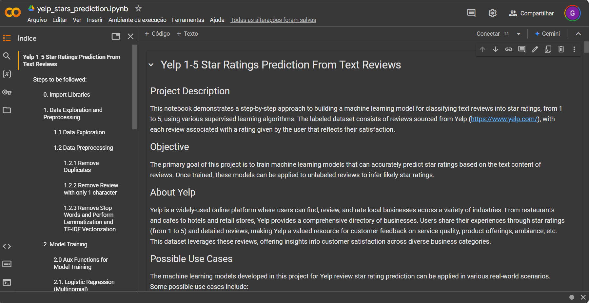
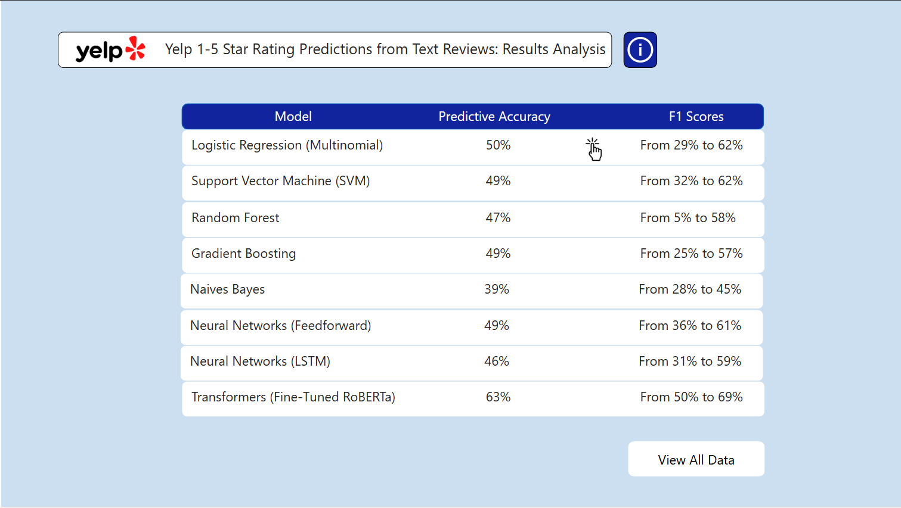

# Yelp 1-5 Star Ratings Prediction From Text Reviews

This project presents a machine learning pipeline for classifying Yelp text reviews into star ratings (1-5) using multiple supervised learning models, ranging from traditional classifiers to more advanced deep learning architectures. Additionally, a Power BI dashboard helps visualize the models' results.

[](https://colab.research.google.com/drive/1-LlGHYMmxs1I94A-L3JyftgCQtLDMI_U#scrollTo=MRqtBh44kreg)

## Project Objective

The goal of this project is to develop machine learning models that can predict the star rating of a review based on its text content. This predictive capability could be applied to unlabeled reviews, providing businesses with insights into customer satisfaction and potential areas of improvement.

## Possible Use Cases

The machine learning models developed in this project for Yelp review star rating prediction can be applied in various real-world scenarios. Some possible use cases include:

1. **Customer Sentiment Analysis**
   - Businesses can use the models to automatically analyze customer feedback and determine the general sentiment of reviews and their intensity. This can help companies identify areas for improvement and monitor customer satisfaction more efficiently.

2. **Automated Review Categorization**
   - The models can automatically categorize reviews by star ratings, enabling businesses to quickly filter and prioritize feedback based on customer satisfaction. This is particularly useful for companies handling large volumes of reviews across various channels, including social media posts, emails, WhatsApp messages, chat logs, review sites without a rating system, and YouTube videos (which can be transcribed and analyzed). These models help businesses make sense of feedback, even when no explicit user rating is provided.

3. **Real-time Feedback Monitoring**
   - The models can be integrated into a real-time feedback monitoring system. As customers submit reviews, messages or posts, the system can automatically predict the star rating and alert the business to low-rated reviews, allowing for faster responses to dissatisfied customers.

4. **Product and Service Improvement**
   - By analyzing trends in low-rated reviews (e.g., consistently 1-star reviews mentioning poor service or food quality), businesses can identify recurring issues and focus their efforts on improving specific areas like customer service, product quality, or delivery times.

5. **Review Summarization and Prioritization**
   - Companies can use the models to prioritize reviews based on their predicted star ratings. Higher-rated reviews can be highlighted for marketing and customer success teams, while lower-rated reviews can be flagged for follow-up actions or further analysis.

6. **Competitive Analysis**
   - The models can be applied to analyze reviews of competitors to understand their strengths and weaknesses. This information can be used to inform marketing strategies, product development, and customer engagement efforts.

7. **Market Research**
   - The predictive models can aid in market research by categorizing and analyzing large amounts of customer feedback, offering insights into customer preferences, product performance, and service satisfaction across different regions or demographics.

## About Yelp

Yelp is an online platform where users rate and review local businesses, such as restaurants, cafes, retail stores, hotels, and service providers. The dataset consists of user-generated reviews, each labeled with a star rating (1 to 5), representing customer satisfaction levels, taking into account various aspects such as service quality, product offerings, and ambiance.

## Project Contents

- **Notebook** (yelp_stars_prediction.ipynb): Step-by-step Jupyter Notebook that covers data preprocessing, model training, and evaluation.
- **Saved Models** (models/): The trained machine learning models ready for deployment and their key metrics.
- **Power BI Dashboard** (results/yelp stars prediction results analysis.pbix): A `.pbix` file providing a visual analysis of each model’s performance, accessible [here](https://app.powerbi.com/view?r=eyJrIjoiMTVmNTMwOGEtYjIxMy00YjUyLWE4NTItYTg1OGE5MjkwYjgwIiwidCI6IjJmZmQxOWViLTU5ZWEtNGJlOS1hOTEwLThhNDE5ZDdjOTM1OSJ9) and also available in the repository for further exploration.

## Power BI Dashboard

[](https://app.powerbi.com/view?r=eyJrIjoiMTVmNTMwOGEtYjIxMy00YjUyLWE4NTItYTg1OGE5MjkwYjgwIiwidCI6IjJmZmQxOWViLTU5ZWEtNGJlOS1hOTEwLThhNDE5ZDdjOTM1OSJ9)

A Power BI dashboard is available for interactive exploration of model performance and evaluation metrics. This dashboard includes visualizations of each model's accuracy, F1 scores, and other relevant metrics for interpreting and comparing model performance. You can find the Power BI '.pbix' file in this repository on the 'results' folder or access it directly [here](https://app.powerbi.com/view?r=eyJrIjoiMTVmNTMwOGEtYjIxMy00YjUyLWE4NTItYTg1OGE5MjkwYjgwIiwidCI6IjJmZmQxOWViLTU5ZWEtNGJlOS1hOTEwLThhNDE5ZDdjOTM1OSJ9).

## Repository Structure

```plaintext
├── yelp_stars_prediction.ipynb                               # Jupyter Notebook with code for model building and evaluation
├── models/                                                   # Folder containing saved trained models and key metrics
├── results/yelp stars prediction results analysis.pbix       # Power BI dashboard for model evaluation and analysis
├── README.md                                                 # Project description and information
```

## Project Workflow

1. **Data Exploration and Preprocessing**
   - Text reviews are cleaned and transformed using methods such as TF-IDF and tokenization to prepare for model training.
   
2. **Model Training**
   - Various models were trained to classify reviews, including:
     - Logistic Regression (Multinomial)
     - Support Vector Machine (SVM)
     - Random Forest
     - Gradient Boosting (XGBoost)
     - Naive Bayes
     - Neural Networks (Feedforward, LSTM, Transformers-based)
   
3. **Model Evaluation**
   - Models were evaluated based on accuracy, F1 score, and other key metrics to determine their suitability for the classification task.
   
4. **Dashboard Visualization**
   - A Power BI dashboard is available to analyze and compare model performance across different metrics, offering insights into the models' strengths and weaknesses.

## Next Steps

1. **Model Interpretability**: Use interpretability tools like SHAP and LIME to understand which words or phrases influence model predictions.
2. **New Data Testing**: Use Yelp's API to fetch new reviews and assess model performance on fresh data to ensure robustness.
3. **Aspect-Based Analysis**: Identify the key reasons for low (1-star) or high (5-star) ratings (e.g., food quality, service).
4. **Deployment**: Develop a pipeline to deploy the model in a real-time setting where users can input reviews and receive predicted star ratings.

## How to Use

1. **Notebook**: Open 'yelp_stars_prediction.ipynb' or access it directly [here](https://colab.research.google.com/drive/1-LlGHYMmxs1I94A-L3JyftgCQtLDMI_U#scrollTo=bMYMKGq6H66B) to explore the code for data processing, model training, and evaluation.
2. **Power BI Dashboard**: Open 'results/yelp stars prediction results analysis.pbix' in Power BI to interactively analyze the model results or access it directly [here](https://app.powerbi.com/view?r=eyJrIjoiMTVmNTMwOGEtYjIxMy00YjUyLWE4NTItYTg1OGE5MjkwYjgwIiwidCI6IjJmZmQxOWViLTU5ZWEtNGJlOS1hOTEwLThhNDE5ZDdjOTM1OSJ9).
3. **Models**: Saved trained models are available in the 'models' folder for deployment or further fine-tuning.

## Requirements

- This project's notebook can be run directly in Google Colab, which provides a cloud-based Jupyter Notebook environment with Python 3.x pre-installed.
- Power BI Desktop (for viewing '.pbix' files)
  
### Library Details

  - **OS** and **Time**: Pre-installed with Python; used for system operations and performance timing.
  - **pandas**: For data manipulation.
  - **matplotlib** and **seaborn**: For data visualization.
  - **numpy**: For numerical operations.
  - **json**: For handling JSON files.
  - **joblib**: For saving and loading models.
  - **torch**: Required for PyTorch models (e.g., Transformers).
  - **xgboost**: For gradient boosting classifier.
  - **datasets**: Used to handle datasets in the Hugging Face ecosystem.
  - **spacy**: NLP library; `en_core_web_sm` model required for text processing.
  - **nltk**: Natural Language Toolkit, with `stopwords` for text processing.
  - **transformers**: Hugging Face library for working with transformer models like RoBERTa.
  - **sklearn** (scikit-learn): For traditional ML model creation, evaluation, and data preprocessing.
  - **tensorflow**: Required for building deep learning models in Keras.

## License

This project is licensed under the MIT License - see the LICENSE file for details.
